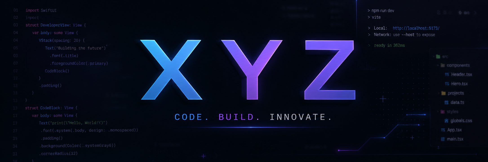

````md
<div align="center">



<br/>

# 👋 Hi, I'm X Y Z

### 🚀 Beginner Developer | Java • JavaScript • HTML • CSS • Python

**Code. Build. Learn. Improve.**

</div>

---

## ✨ About Me

Hello! I'm **X Y Z**, a beginner programmer learning how to build websites, applications, and simple programming projects.

I enjoy discovering new technologies, writing clean code, fixing bugs, and improving my skills step by step.  
My main goal is to become better every day and create projects that show my progress as a developer.

---

## 🛠️ Tech & Tools

<div align="center">

### Languages


<br/><br/>

### Tools


</div>

---

## 📚 Currently Learning

```txt
JavaScript    ███████░░░
HTML          ████████░░
CSS           ████████░░
Java          ██████░░░░
Python        ██████░░░░
Git & GitHub  ███████░░░
````

I am currently focusing on:

* 🌐 Building websites with **HTML, CSS and JavaScript**
* ☕ Learning programming basics with **Java**
* 🐍 Creating simple scripts and programs in **Python**
* 🧠 Improving my logic and problem-solving skills
* 🔧 Learning how to use **Git and GitHub**

---

## 🚀 My Goals

My main goals are to create more projects, write cleaner code, learn frontend development, understand programming fundamentals, and build a nice GitHub portfolio step by step.

---

## 📌 What You Can Find Here

On my GitHub profile you can find:

* small programming projects,
* websites and frontend experiments,
* Java exercises,
* Python scripts,
* HTML and CSS layouts,
* projects created while learning.

Every repository is a part of my programming journey.

---

## 📊 GitHub Stats

<div align="center">


<br/><br/>


</div>

---

## 🌱 Developer Mindset

> Every line of code is a step forward.

I know that learning programming takes time, practice, and patience.
That is why I try to code regularly, build projects, fix mistakes, and keep improving.

---

<div align="center">

### Thanks for visiting my profile! 🚀

**Follow my journey and check out my projects.**

</div>
```
